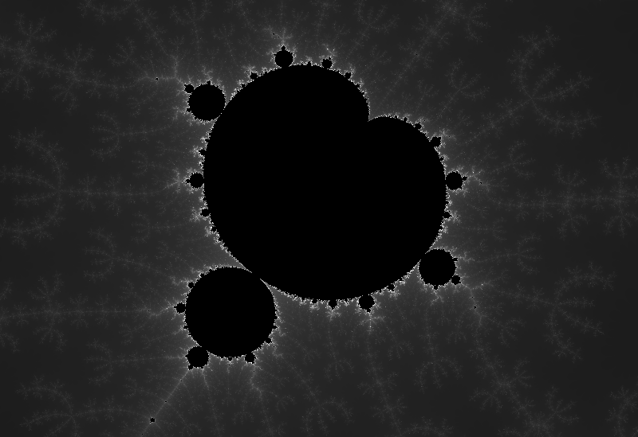

# mandelbrot



A [Mandelbrot set](https://en.wikipedia.org/wiki/Mandelbrot_set) renderer made
with C and [raylib](https://www.raylib.com/) with support for GPU acceleration.

## Usage

Currently the keybinds are the following:

| Key               | Action                  |
| ----------------- | ----------------------- |
| G                 | Toggle GPU Acceleration |
| R                 | Render png image        |
| B                 | Toggle debug info       |
| Mouse left click  | Zoom in                 |
| Mouse right click | Zoom out                |
| Mouse wheel up    | Zoom in                 |
| Mouse wheel down  | Zoom out                |
| Left shift        | Increase iterations     |
| Left ctrl         | Decrease iterations     |
| Right shift       | Increase resolution     |
| Right ctrl        | Decrease resolution     |

## Building

For building the project you'll need a C compiler and the raylib library
installed.

```bash
make
```
